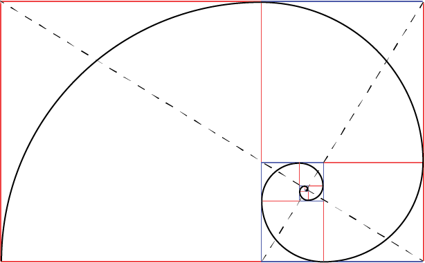

# Resources from the Python4Physics Project

## Find slides and code samples <a href="https://drive.google.com/drive/folders/1ztGUfdyYO7ATZ6cmxIjeusdafHC8Agf2?usp=sharing" target="_blank">here.</a>

## See the following description: <a href="https://tddyrogers.github.io/python4physics.github.io/documents/Python4Physics.pdf" target="_blank">Python4Physics: A physics outreach program</a>

